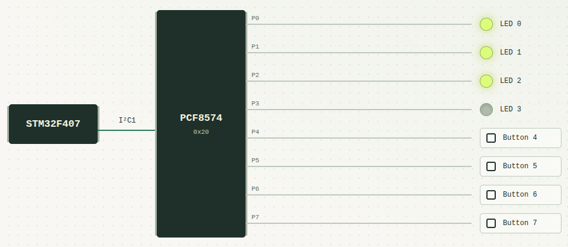

# Modelando um expansor de I/O via I²C (PCF8574) no Renode

[English](README.md) | **Português (Brasil)**

O Renode permite executar firmware com modelos de hardware prontos. Quando um periférico não está disponível, é possível implementar seu comportamento em C# e conectá-lo à plataforma simulada.

Este tutorial cria um modelo do periférico **PCF8574, um expansor de oito entradas e saídas digitais controlado via I2C**. Ele permite ampliar os I/Os de um microcontrolador através do barramento I2C. O microcontrolador envia comandos para atuar nas saídas e lê o estado das entradas.

Para testar o caso de uso, o **PCF8574 é conectado ao I2C de um STM32F407**. O firmware alterna quatro LEDs pelas saídas P0..P3 e imprime na UART as mudanças dos botões ligados a P4..P7. Ao final, um painel web permite observar os LEDs e acionar os botões, sem placa física.

> **Escopo:** o foco deste tutorial é como criar um modelo básico de periférico a partir do datasheet e demonstrar seu uso com um STM32. Recursos no projeto fora desse escopo foram 100% *vibe coded* (interface gráfica (painel web), testes automatizados com Python/RobotFramework, entre outros).




```text
STM32F407 --I2C1--> PCF8574 --P0..P3--> LEDs
                      ^
                      |
                   P4..P7
                   Botões

STM32 USART2 -----------------------> Terminal UART
```

## 1. Preparar o projeto

Requisitos: [Renode 1.16.1](https://renode.readthedocs.io/en/latest/introduction/installing.html), Python 3.10 ou superior.

Este repositório já tem o projeto pronto, mas para seguir o tutorial, crie uma nova pasta chamada `my-pcf8574`. Os comandos abaixo transferem para a paste o firmware e os auxiliares de interface e testes; o modelo e a plataforma serão criados por você nas próximas etapas.

**Windows / PowerShell:**

```powershell
$reference = (Get-Location).Path
New-Item -ItemType Directory ../my-pcf8574 -ErrorAction Stop
Set-Location ../my-pcf8574
New-Item -ItemType Directory models, platforms, scripts, firmware, tools, tests, web
Copy-Item "$reference/firmware/demo.elf" firmware/
Copy-Item "$reference/tools/renode_client.py" tools/
Copy-Item "$reference/tools/lab.py" tools/
Copy-Item "$reference/tests/check.py" tests/
Copy-Item "$reference/scripts/bridge.py" scripts/
Copy-Item "$reference/web/index.html" web/
python --version
```

**Linux / Bash:**

```bash
reference="$PWD"
mkdir ../my-pcf8574
cd ../my-pcf8574
mkdir models platforms scripts firmware tools tests web
cp "$reference/firmware/demo.elf" firmware/
cp "$reference/tools/renode_client.py" "$reference/tools/lab.py" tools/
cp "$reference/tests/check.py" tests/
cp "$reference/scripts/bridge.py" scripts/
cp "$reference/web/index.html" web/
python3 --version
```
Use `python3` no lugar de `python` nos próximos comandos, se necessário.

</details>

**Verificação:** `renode --version` deve mostrar a versão instalada, e `python --version`, Python 3.10 ou superior. Os comandos abaixo usam `renode` disponível no PATH.

Todos os caminhos seguintes são relativos à pasta **my-pcf8574**. Comandos identificados como **Terminal** são executados no PowerShell ou Bash; comandos do **Monitor** são executados dentro do Renode.

## 2. Implementar o PCF8574

O comportamento implementado segue este recorte do [datasheet TI PCF8574, revisão K](https://www.ti.com/lit/ds/symlink/pcf8574.pdf):

| Comportamento | Implementação | Referência |
| --- | --- | --- |
| Pinos inicialmente em nível alto | Latch inicia em `0xFF` | Seção 7.1 |
| Zero escrito força nível baixo | Zero no latch domina o nível observado | Figura 7-2 |
| Um escrito libera o pino com pull-up fraco | Sinal externo pode baixar o nível | Figura 7-2 |
| Leitura observa os pinos | Retornar o estado efetivo, não só o latch | Figura 7-4 |
| Atualização por bytes sucessivos | Processar cada byte recebido | Figura 7-3 |
| A2/A1/A0 em zero | Endereço I2C de sete bits `0x20` | Seção 7.3.3 |

Não há registrador de direção: escrever `1` permite usar o pino como entrada. Neste modelo digital, o nível lógico observado é ditado no código pela operação `outputLatch & externalLevels`. Correntes, resistências, entre outras características elétricas não são simuladas.

**Escritas sucessivas:** a seção 7.3.1 da datasheet afirma que bytes adicionais na mesma escrita são ignorados, mas a figura 7-3 mostra dois bytes atualizando o port. O `foreach` abaixo adota o comportamento do diagrama; essa é uma escolha do modelo diante da divergência. O firmware envia um byte por transação. Transações separadas continuam podendo atualizar o port normalmente.

Crie `models/PCF8574.cs`:

<!-- tutorial-file: models/PCF8574.cs -->
```csharp
using System;
using System.Collections.Generic;
using Antmicro.Renode.Core;
using Antmicro.Renode.Peripherals.I2C;

namespace Antmicro.Renode.Peripherals.Tutorial
{
    public class PCF8574 : II2CPeripheral, IGPIOReceiver, INumberedGPIOOutput
    {
        // Last command from the I2C master.
        private byte outputLatch;
        // External levels survive chip reset: a held button stays held.
        private byte externalLevels = 0xFF;

        public IReadOnlyDictionary<int, IGPIO> Connections { get; }

        public PCF8574()
        {
            // Create the eight numbered GPIO connectors.
            var pins = new Dictionary<int, IGPIO>();
            for(var pin = 0; pin < 8; pin++)
            {
                pins.Add(pin, new GPIO());
            }
            Connections = pins;
            Reset();
        }


        // Restore the peripheral's power-on latch state.
        public void Reset()
        {
            outputLatch = 0xFF;
            UpdatePinLevels();
        }

        // II2CPeripheral requires Write, Read and FinishTransmission.
        public void Write(byte[] data)
        {
            // Follow TI Rev. K Figure 7-3: each byte updates the port.
            // Section 7.3.1 conflicts with that diagram; see the README note.
            foreach(var value in data)
            {
                outputLatch = value;
                UpdatePinLevels();
            }
        }

        public byte[] Read(int count = 1)
        {
            var data = new byte[count];
            for(var i = 0; i < count; i++)
            {
                data[i] = EffectivePinLevels;
            }
            return data;
        }

        public void FinishTransmission()
        {
            // No register pointer or partial command to discard on STOP.
        }

        // IGPIOReceiver requires OnGPIO to receive external pin changes.
        public void OnGPIO(int number, bool value)
        {
            if(number < 0 || number >= 8)
            {
                throw new ArgumentOutOfRangeException(nameof(number));
            }
            var mask = (byte)(1 << number);
            if(value)
            {
                externalLevels |= mask;
            }
            else
            {
                externalLevels &= (byte)~mask;
            }
            UpdatePinLevels();
        }

        // Combine the master's command with the externally driven levels.
        // Latch 0 actively pulls the pin low: 0 & external = 0.
        // Latch 1 releases the pin: 1 & external = external.
        // An external low can override a released pin, but an external high
        // cannot override a latched low. AND models this digitally, not electrically.
        private byte EffectivePinLevels => (byte)(outputLatch & externalLevels);

        private void UpdatePinLevels()
        {
            for(var pin = 0; pin < 8; pin++)
            {
                Connections[pin].Set((EffectivePinLevels & (1 << pin)) != 0);
            }
        }

    }
}
```

`II2CPeripheral` atende o barramento I2C; `IGPIOReceiver` recebe mudanças externas dos botões; `INumberedGPIOOutput` expõe os oito conectores de saída, usados pelos LEDs/botões neste exemplo. Esses contratos separam o [comportamento do periférico](https://renode.readthedocs.io/en/latest/advanced/writing-peripherals.html) das conexões da plataforma.

O latch guarda o comando do mestre (Nesse exemplo um STM32), enquanto `externalLevels` guarda o sinal externo. `OnGPIO` altera um bit desse sinal e `UpdatePinLevels` publica o resultado nos conectores. O reset não solta um botão que continua pressionado externamente.

**Verificação de compilação do PCF8574.cs, no Terminal:**

Execute o Renode diretamente, a partir da pasta `my-pcf8574`.

```sh
renode --console --disable-gui --plain models/PCF8574.cs
```

`--console` abre o Monitor no terminal, `--disable-gui` desativa a interface gráfica e `--plain` simplifica a apresentação. O arquivo passado no final é carregado na inicialização. Também é possível abrir o Renode sem esse argumento e executar no **Monitor**:

```text
include @models/PCF8574.cs
```

O Renode deve carregar `PCF8574.cs` e retornar ao prompt `(monitor)` sem erros de compilação. Digite `quit` para sair. Isso verifica a compilação; a próxima etapa instancia o dispositivo para verificar seu comportamento.


## 3. Arquivos .repl/.resc - Conectando o modelo a LEDs e botões

Um arquivo **`.repl` descreve uma plataforma do Renode**: quais modelos instanciar, seus parâmetros e suas conexões. Um arquivo **`.resc`, são scripts do Renode**, reunindo comandos do Monitor do Renode para montar e executar uma sessão.

Nesta etapa, a máquina terá **somente o PCF8574, quatro LEDs e quatro botões**.

Crie `platforms/pcf8574.repl`:

<!-- tutorial-file: platforms/pcf8574.repl -->
```text
pcf8574: Tutorial.PCF8574 @ sysbus
    preinit:
        include @models/PCF8574.cs
    0 -> led0@0
    1 -> led1@0
    2 -> led2@0
    3 -> led3@0

led0: Miscellaneous.LED @ sysbus
    invert: true
led1: Miscellaneous.LED @ sysbus
    invert: true
led2: Miscellaneous.LED @ sysbus
    invert: true
led3: Miscellaneous.LED @ sysbus
    invert: true

button4: Miscellaneous.Button @ sysbus
    invert: true
    -> pcf8574@4
button5: Miscellaneous.Button @ sysbus
    invert: true
    -> pcf8574@5
button6: Miscellaneous.Button @ sysbus
    invert: true
    -> pcf8574@6
button7: Miscellaneous.Button @ sysbus
    invert: true
    -> pcf8574@7
```

### O que cada declaração significa

| Trecho | Significado |
| --- | --- |
| `pcf8574:` | Nome desta instância na plataforma |
| `Tutorial.PCF8574` | Classe C# do modelo, relativa a `Antmicro.Renode.Peripherals` |
| `@ sysbus` | Registra o objeto na máquina, sem endereço de memória nesta declaração |
| `preinit: include @models/PCF8574.cs` | Carrega o código antes de criar a instância; `@` aqui identifica um caminho de arquivo |
| `0 -> led0@0` | Liga `Connections[0]` do PCF8574 à entrada zero do LED |
| `-> pcf8574@4` | Liga a saída do botão ao pino P4, recebido por `OnGPIO(4, value)` |

`sysbus` existe em toda máquina Renode. A indentação agrupa os atributos de cada dispositivo; use espaços. Referência: [descrição de plataformas](https://renode.readthedocs.io/en/latest/basic/describing_platforms.html).

Os LEDs representam VCC, resistor, LED e pino do PCF: **nível baixo acende**, por isso `invert: true`. Nos botões, essa opção faz a pressão enviar zero e a liberação enviar um.

Crie `scripts/platform.resc`:

<!-- tutorial-file: scripts/platform.resc -->
```text
mach create "pcf8574-lab"
using sysbus
machine LoadPlatformDescription @platforms/pcf8574.repl
```

`mach create` cria a máquina; `using sysbus` permite abreviar os nomes no Monitor; `LoadPlatformDescription` monta os dispositivos e conexões dos IOs descritas no REPL.

### Verificar as entradas ao pressionar os botões

**Terminal:**

```sh
renode --console --disable-gui --plain scripts/platform.resc
```

Após reset, o latch contém `0xFF`: todos os pinos estão liberados e podem ser usados como entradas. Pressionar os botões deve alterar o nível observado internamente pelo PCF.

Os nomes usados no Monitor vêm das declarações do REPL: `pcf8574:`, `led0:` e `button4:`. Como esses objetos foram registrados com `@ sysbus`, seus caminhos são `sysbus.pcf8574`, `sysbus.led0` e `sysbus.button4`. Se uma instância for renomeada no REPL, o comando também precisa usar o novo nome.

Execute os passos abaixo no **Monitor** aberto pelo comando anterior, mantendo a mesma sessão.

**1. Consultar o estado inicial do PCF8574**

<!-- tutorial-model-monitor -->
```text
python "dev = monitor.Machine['sysbus.pcf8574']; print(list(dev.Read(1)))"
```

`python` executa código no interpretador embutido do Renode, não no Python do terminal. `monitor.Machine[...]` localiza a instância pelo caminho registrado; `dev` é apenas uma variável para reutilizá-la nos próximos comandos, não um nome definido no REPL.

`Read(1)` chama o método C# do modelo e solicita um byte. `list(...)` e `print(...)` exibem o resultado em decimal. **Esperado: `[255]`, equivalente a `0xFF`**, com todos os pinos liberados.

**2. Conferir o LED0**

<!-- tutorial-model-monitor -->
```text
sysbus.led0 State
```

O primeiro termo identifica o LED declarado como `led0:`; `State` consulta sua propriedade de estado. **Esperado: `False`**, pois o LED é ativo em zero e P0 está alto após reset.

**3. Pressionar o botão ligado a P4**

<!-- tutorial-model-monitor -->
```text
sysbus.button4 Press
```

`Press` aciona o modelo declarado como `button4:`. O nome do botão não determina seu destino: é a conexão `-> pcf8574@4` no REPL que o liga a P4. Com `invert: true`, pressionar envia nível baixo para `OnGPIO(4, false)` do PCF8574.

**4. Aplicar o evento na simulação**

<!-- tutorial-model-monitor -->
```text
emulation RunFor "0.001"
```

Avança **1 ms de tempo virtual** e para novamente. Esse avanço permite entregar o evento do botão mesmo sem CPU; não é uma espera de 1 ms no computador.

**5. Ler o resultado**

<!-- tutorial-model-monitor -->
```text
python "print(list(dev.Read(1)))"
```

A variável `dev` continua apontando para o mesmo PCF8574. **Esperado: `[239]`, equivalente a `0xEF` (`11101111` em binário)**: apenas P4 ficou baixo. O botão mudou o valor da variável`externalLevels` do código C#; o latch continua em `0xFF`.

**6. Soltar o botão e conferir a recuperação**

<!-- tutorial-model-monitor -->
```text
sysbus.button4 Release
emulation RunFor "0.001"
python "print(list(dev.Read(1)))"
```

`Release` solta o mesmo botão; o avanço seguinte entrega o nível alto ao PCF8574. **A leitura deve voltar a `[255]` (`0xFF`)**, sem uma nova escrita no latch. Isso confirma o caminho botão, conexão GPIO e estado observado pelo modelo.

### Verificar uma saída

Na **mesma sessão do Monitor**, escreva diretamente no modelo e depois aplique reset:

<!-- tutorial-output-monitor -->
```text
python "from System import Array, Byte; dev.Write(Array[Byte]([0xFE])); print(list(dev.Read(1)))"
sysbus.led0 State
python "dev.Reset(); print(list(dev.Read(1)))"
sysbus.led0 State
```

**Saída esperada:** `[254]` e `True` após a escrita; `[255]` e `False` após o reset. O bit P0 baixo acende o LED0.

Essas chamadas a `Read` e `Write` testam diretamente as funções do modelo C#, não são uma transação I2C. Digite `quit` para encerrar.

## 4. Conectar ao I2C do STM32

Crie `platforms/stm32.repl` para importar o STM32F4 distribuído com o Renode:

<!-- tutorial-file: platforms/stm32.repl -->
```text
using "platforms/cpus/stm32f4.repl"
```

Essa definição fornece a CPU e os periféricos internos do STM32, incluindo o controlador `i2c1`.

### Consultar os periféricos disponíveis no STM32

Antes de conectar o PCF8574, abra uma sessão vazia do Renode, no terminal e na raiz do tutorial:

```sh
renode --console --disable-gui --plain
```

No **Monitor**, crie uma máquina para inspecionar o STM32:

<!-- tutorial-stm32-monitor -->
```text
mach create "stm32-inspect"
```

Carregue apenas a definição do STM32 que acabamos de criar, sem o PCF8574:

**Windows:**

<!-- tutorial-stm32-monitor-windows -->
```text
machine LoadPlatformDescription @platforms\stm32.repl
```

**Linux:**

<!-- tutorial-stm32-monitor-linux -->
```text
machine LoadPlatformDescription @platforms/stm32.repl
```

Consulte os periféricos da máquina selecionada:

<!-- tutorial-stm32-monitor -->
```text
peripherals
```

O comando mostra a árvore de dispositivos carregados nessa máquina. Entre os periféricos do STM32, deve aparecer uma entrada `i2c1` iniciada no endereço `0x40005400`, semelhante a:

```text
i2c1 (STM32F1_I2C)
    <0x40005400, 0x4000543F>
```

`i2c1` é o nome da instância do controlador I2C1 na definição importada. Por isso podemos usá-lo como destino da conexão do PCF8574. O intervalo mostrado corresponde aos registradores do controlador na memória do STM32.

**Verificação:** `i2c1` deve existir, ainda sem `pcf8574` abaixo dele. Digite `quit` para encerrar essa sessão de inspeção antes de continuar.

### Registrar o PCF8574 no controlador

Em `platforms/pcf8574.repl`, troque **somente a primeira linha**, mantendo o `preinit` e todas as conexões de LEDs e botões:

<!-- tutorial-registration: platforms/pcf8574.repl -->
```text
pcf8574: Tutorial.PCF8574 @ i2c1 0x20
```

Agora `@ i2c1` registra o PCF8574 como dispositivo no **controlador I2C1 do STM32**. `0x20` é o endereço I2C de sete bits escolhido para o PCF8574, correspondente aos pinos A2, A1 e A0 em zero. Referência: seção 7.3.3 do [datasheet](https://www.ti.com/lit/ds/symlink/pcf8574.pdf).

Atualize `scripts/platform.resc` para carregar o STM32 **antes** do PCF8574, pois `i2c1` precisa existir:

<!-- tutorial-update: scripts/platform.resc -->
```text
mach create "pcf8574-lab"
using sysbus
machine LoadPlatformDescription @platforms/stm32.repl
machine LoadPlatformDescription @platforms/pcf8574.repl
cpu PerformanceInMips 100
```

`PerformanceInMips` configura a taxa de execução simulada da CPU; não é o clock do SysTick.

### Verificar a conexão

**Terminal:**

```sh
renode --console --disable-gui --plain scripts/platform.resc
```

No **Monitor**, consulte novamente a árvore de periféricos:

<!-- tutorial-i2c-monitor -->
```text
peripherals
```

**Saída esperada (trecho):** agora `pcf8574` aparece abaixo de `i2c1`, indicando que está registrado nesse controlador:

```text
i2c1 (STM32F4_I2C)
    <0x40005400, 0x400057FF>
    pcf8574 (PCF8574)
        Address: 32
```

`Address: 32` mostra em decimal o endereço I2C `0x20` definido no REPL.

Para consultar o estado inicial do expansor, use seu novo caminho na árvore:

<!-- tutorial-i2c-monitor -->
```text
python "dev = monitor.Machine['sysbus.i2c1.pcf8574']; print(list(dev.Read(1)))"
```

**Saída esperada:** `[255]`. O caminho mudou de `sysbus.pcf8574` para `sysbus.i2c1.pcf8574`, acompanhando a nova conexão.

Isso verifica a montagem da plataforma. A CPU ainda não executou firmware; a comunicação I2C pelo mestre será testada na próxima seção. Digite `quit`.

## 5. Executar o firmware STM32

O firmware fornecido foi gerado a partir do STM32CubeMX para a placa **STM32F407G-DISC1**, MCU **STM32F407VGTx**, com HAL. O projeto completo está em [firmware](firmware), com o [arquivo CubeMX](firmware/pcf8574-demo.ioc) e o [main.c](firmware/Core/Src/main.c).

A aplicação inicializa o port em `0xFF`, mantém P4..P7 liberados para entrada e alterna um LED a cada 250 ms, percorrendo P0..P3. A sequência acende P0, P1, P2, P3 e depois apaga P0, P1, P2, P3. Mudanças das entradas são impressas na USART2.

Os trechos abaixo já fazem parte do [main.c](firmware/Core/Src/main.c) fornecido; não é necessário adicioná-los para executar o ELF do tutorial.

### Usar os pinos como entradas e saídas

Como implementamos na [seção 2](#2-implementar-o-pcf8574), o PCF8574 tem pinos **quase bidirecionais**, sem registrador de direção. Não há um comando separado para configurar `input` ou `output`:

| Bit escrito no port | Efeito no pino | Uso neste firmware |
| --- | --- | --- |
| `0` | Força nível baixo | Acender um LED em P0..P3, ligado como ativo em nível baixo |
| `1` | Libera o pino com pull-up fraco; um sinal externo pode levá-lo a zero | Apagar um LED ou permitir a leitura de um botão em P4..P7 |

Portanto, escrever `1` não seleciona um modo exclusivo de entrada, nem produz uma saída alta forte. A função do pino depende também do circuito conectado. Esse é o comportamento da figura 7-2 do [datasheet](https://www.ti.com/lit/ds/symlink/pcf8574.pdf), representado no modelo por `outputLatch & externalLevels`.

As constantes do firmware definem o endereço do expansor e quais bits devem permanecer liberados:

<!-- tutorial-firmware-excerpt -->
```c
#define PCF_ADDRESS (0x20U << 1)
#define INPUT_MASK 0xF0U
```

`INPUT_MASK` vale `11110000` em binário: mantém P4..P7 em `1` a cada escrita. P0..P3 recebem os níveis desejados dos LEDs. A HAL recebe o endereço de sete bits deslocado uma posição (`0x20 << 1`); no REPL, o endereço continua sendo `0x20`.

### Inicializar e acessar o expansor por I2C

A função `write_port` envia um byte pelo I2C1 do STM32:

<!-- tutorial-firmware-excerpt -->
```c
static void write_port(uint8_t value)
{
    if(HAL_I2C_Master_Transmit(&hi2c1, PCF_ADDRESS, &value, 1, 100U) != HAL_OK)
    {
        fail("ERROR: PCF8574 write\r\n");
    }
}
```

O `1` é a quantidade de bytes, e `100U` é o timeout em milissegundos. Não enviamos um endereço de registrador: o byte representa os oito pinos. Na simulação, a transação passa pelo modelo do I2C1 e chega ao `Write` do PCF8574, que atualiza `outputLatch` e os conectores dos LEDs.

Após inicializar I2C1 e USART2, `main` chama esta validação:

<!-- tutorial-firmware-excerpt -->
```c
static void validate_pcf8574(void)
{
    // All LEDs off (active-low). P4..P7 remain released for button input.
    write_port(0xFFU);
    uint8_t observed = read_port();
    // A held button is valid at boot, so do not compare the input bits to 1.
    if((observed & 0x0FU) != 0x0FU) { fail("ERROR: output readback\r\n"); }
    print_line("PCF8574 ready: P0..P3 LEDs; P4..P7 buttons\r\n");
}
```

`0xFF` libera todos os pinos: os quatro LEDs começam apagados e os botões podem alterar os níveis de entrada. A conferência usa `0x0F` para verificar apenas P0..P3, pois um botão pressionado durante a inicialização pode legitimamente fazer P4..P7 retornar zero. `read_port` usa `HAL_I2C_Master_Receive` para receber um byte, chegando ao `Read` do modelo.

### Alternar um LED a cada 250 ms

Antes do `while`, o firmware prepara o estado dos LEDs e a referência de tempo:

<!-- tutorial-firmware-excerpt -->
```c
uint8_t ledLevels = 0x0FU;
uint8_t nextLed = 0U;
uint8_t previousInputs = 0xFFU;  // Sentinel: also print the first sample.
uint32_t lastToggle = HAL_GetTick();
```

Dentro do laço, este bloco alterna um único pino por intervalo:

<!-- tutorial-firmware-excerpt -->
```c
if((uint32_t)(HAL_GetTick() - lastToggle) >= 250U)
{
    lastToggle += 250U;
    // Toggle ONE pin per step: P0, P1, P2, P3, then repeat.
    ledLevels ^= (uint8_t)(1U << nextLed);
    nextLed = (uint8_t)((nextLed + 1U) % 4U);
    // Never copy observed button lows back into the output latch.
    write_port((uint8_t)(INPUT_MASK | ledLevels));
}
```

O XOR (`^=`) inverte somente o bit do LED selecionado; o módulo `% 4` percorre P0, P1, P2 e P3 repetidamente. Os bytes escritos começam em `0xFF` e seguem `0xFE`, `0xFC`, `0xF8`, `0xF0`: um LED adicional acende a cada passo. Depois seguem `0xF1`, `0xF3`, `0xF7`, `0xFF`, apagando um por vez.

O OR com `INPUT_MASK` preserva P4..P7 liberados, pois os usamos como sensores do estado dos botões, logo não faz sentido setar diferentes niveis logicos desses pinos via firmware, apenas os mantemos como "entradas/sensores".

### Ler os botões e imprimir mudanças

Também dentro do `while`, a leitura separa os quatro bits de entrada:

<!-- tutorial-firmware-excerpt -->
```c
uint8_t inputs = (uint8_t)((read_port() >> 4) & 0x0FU);
if(inputs != previousInputs)
{
    char message[48];
    snprintf(message, sizeof(message), "INPUT P7..P4=0x%X\r\n", (unsigned)inputs);
    print_line(message);
    previousInputs = inputs;
}
```

O deslocamento `>> 4` coloca P4..P7 nos quatro bits inferiores; a máscara `0x0F` mantém apenas esse grupo. `print_line` transmite pela USART2, e a comparação evita repetir mensagens enquanto as entradas não mudam. O valor inicial `previousInputs = 0xFF` garante que a primeira amostra seja impressa. O laço termina com `HAL_Delay(5U)`, permitindo consultar os botões entre as alternâncias dos LEDs, sem esperar 250 ms para cada leitura.

Isso fecha o caminho apresentado na seção 2: pressionar um botão chama `OnGPIO`, que altera `externalLevels`; como o bit correspondente de `outputLatch` permanece em `1`, o `Read` retorna o nível externo. Solto, o botão é lido como `1`; pressionado, como `0`.

**O que conferir ao executar abaixo:** sem botões pressionados, a UART deve mostrar `INPUT P7..P4=0xF`. Ao pressionar apenas P4, deve mostrar `0xE`; ao soltar, `0xF` novamente. Os LEDs devem continuar alternando independentemente dessas mudanças.

### Sobrescrever a configuração do SysTick

O firmware configura SYSCLK e HCLK em **168 MHz**, enquanto a plataforma `stm32f4.repl` do Renode 1.16.1 define `systickFrequency` em **72 MHz**. É necessário alinhar esse parâmetro para que os intervalos calculados pelo firmware tenham a duração esperada na simulação.

Substitua o conteúdo de `platforms/stm32.repl` por:

<!-- tutorial-update: platforms/stm32.repl -->
```text
using "platforms/cpus/stm32f4.repl"

nvic:
    systickFrequency: 168000000
```

O `using` importa a definição original; o bloco `nvic:` sobrescreve apenas o atributo indicado do dispositivo já declarado nessa definição.

Esse ajuste é aplicado durante a criação da plataforma. Encerre a sessão anterior e carregue uma nova após alterar o arquivo. Na seção 3 não havia CPU; na seção 4 ela ainda não executava firmware. Esses testes não dependiam dessa frequência.

### Carregar o binário

Crie `scripts/demo.resc`:

<!-- tutorial-file: scripts/demo.resc -->
```text
include @scripts/platform.resc
sysbus LoadELF @firmware/demo.elf
showAnalyzer sysbus.usart2
```

O script carrega a plataforma com `include`, carrega o **firmware já compilado e disponibilizado** em `firmware/demo.elf` com `LoadELF` e abre a saída da USART2 com `showAnalyzer`. Não é preciso compilar o firmware para executar esta demo.

### Verificar o firmware

**Terminal:**

```sh
renode --console --disable-gui --plain scripts/demo.resc
```

Em um Monitor vazio, o equivalente é `include @scripts/demo.resc`.

No **Monitor**, use uma sessão nova, sem executar `start` antes. Execute os blocos abaixo separadamente.

Avance 270 ms de tempo virtual para inicializar o firmware e alcançar a primeira alternância:

<!-- tutorial-monitor -->
```text
emulation RunFor "0.270"
```

Na UART, confira a mensagem `PCF8574 ready` e `INPUT P7..P4=0xF`, com os botões soltos. Consulte o LED conectado a P0:

<!-- tutorial-monitor -->
```text
sysbus.led0 State
```

**Esperado:** `True` (LED aceso).

Pressione o botão ligado a P4; `button4` é o nome definido no REPL:

<!-- tutorial-monitor -->
```text
sysbus.button4 Press
```

Avance o tempo para entregar o sinal e permitir a leitura pelo firmware:

<!-- tutorial-monitor -->
```text
emulation RunFor "0.100"
```

**Esperado na UART:** `INPUT P7..P4=0xE`. Consulte também o byte completo do modelo:

<!-- tutorial-monitor -->
```text
python "print(list(monitor.Machine['sysbus.i2c1.pcf8574'].Read(1)))"
```

**Esperado:** `[238]` (`0xEE`): P4 está baixo e P0 continua baixo, mantendo LED0 aceso. Esta consulta chama `Read` diretamente; a mensagem UART acima veio da leitura I2C realizada pelo firmware.

Solte o mesmo botão:

<!-- tutorial-monitor -->
```text
sysbus.button4 Release
```

Avance mais 100 ms:

<!-- tutorial-monitor -->
```text
emulation RunFor "0.100"
```

**Esperado na UART:** `INPUT P7..P4=0xF`. Confira a leitura novamente:

<!-- tutorial-monitor -->
```text
python "print(list(monitor.Machine['sysbus.i2c1.pcf8574'].Read(1)))"
```

**Esperado:** `[254]` (`0xFE`): P4 voltou a alto; LED0 permanece aceso. O tempo acumulado é 470 ms, ainda antes da segunda alternância.

`RunFor` executa o intervalo de tempo virtual solicitado e para. Para execução contínua, use `start`; para interromper, `pause`. Saia com `quit`.

### Recompilar com STM32CubeIDE (opcional)

Se quiser **editar o firmware da demo**, importe a pasta `firmware` do repositório original em `File > Import > STM32CubeMX/STM32CubeIDE Project`. Edite, por exemplo, `Core/Src/main.c` e compile `pcf8574-demo` em `Debug`.

Em seguida, edite a linha `sysbus LoadELF` de **`scripts/demo.resc`** para apontar para o novo arquivo `.elf`. Exemplo com caminho relativo à pasta `my-pcf8574`:

```text
sysbus LoadELF @../renode-pcf8574-tutorial/firmware/Debug/pcf8574-demo.elf
```

Ajuste o caminho se o projeto estiver em outra pasta. Como alternativa, mantenha `demo.resc` inalterado e substitua o ELF da demo, executando na pasta `my-pcf8574`:

```powershell
Copy-Item "$reference/firmware/Debug/pcf8574-demo.elf" firmware/demo.elf
```

No Bash: `cp "$reference/firmware/Debug/pcf8574-demo.elf" firmware/demo.elf`. Se reabriu o terminal, redefina `reference` com o caminho do repositório original. Reinicie o Renode e repita a verificação anterior.

**Alternativa sem IDE:** com a Arm GNU Toolchain no PATH, execute na raiz do repositório original:

```sh
python tools/build_firmware.py
```

O script opcional gera `firmware/demo.elf` nesse repositório; a opção `--gcc "caminho/do/arm-none-eabi-gcc"` permite indicar o compilador. Aponte `LoadELF` para esse arquivo ou copie-o para o `firmware/demo.elf` do exercício. Reinicie o Renode após recompilar.

## 6. Painel web (Vibe Coded)

Encerre o Monitor e execute no **Terminal**:

```sh
python tools/lab.py
```

O painel abre em [localhost:8000](http://127.0.0.1:8000). Clique em um botão para pressionar e novamente para soltar. Os LEDs exibem os estados dos modelos do Renode; o terminal apresenta os caracteres enviados pelo firmware na USART2.

```text
Navegador --HTTP--> Python 3 --XML-RPC--> Renode
```

O painel é específico deste exemplo. Usa o [servidor remoto de testes do Renode](https://renode.readthedocs.io/en/latest/introduction/testing.html), compatível com Robot Framework, sem exigir sua instalação. `scripts/bridge.py` é executado pelo Python embutido do Renode para consultar os LEDs e capturar a UART.

**Verificação sugerida:**

| Ação | Resultado esperado |
| --- | --- |
| Pressionar P4 | UART: `INPUT P7..P4=0xE` |
| Manter P4 e pressionar P7 | UART: `INPUT P7..P4=0x6` |
| Soltar ambos | UART termina em `INPUT P7..P4=0xF` |
| Pausar e avançar 250 ms | Um LED muda de estado por passo |

O efeito de um botão acionado enquanto pausado aparece no próximo avanço. Encerre com `Ctrl+C` no terminal.

## Testes automatizados (Vibe Coded)

Na pasta do projeto:

```sh
python tests/check.py all
```

São esperadas as linhas `PASS model:` e `PASS firmware:`. O primeiro teste verifica o modelo isolado; o segundo executa o firmware e verifica LEDs, botões e UART.

## Limitações e diagnóstico

O modelo não implementa `INT`, correntes, curtos, temporização elétrica do I2C ou resolução de múltiplos drivers no mesmo pino. Trata-se de uma simulação funcional digital, não de equivalência elétrica completa ao CI.

| Problema | Ajuste |
| --- | --- |
| Renode não encontrado | Adicione a instalação ao PATH. No PowerShell, a alternativa é `& "C:/Program Files/Renode/renode.exe"`; nos auxiliares Python, use `--renode "caminho/do/executavel"` |
| Arquivo não encontrado | Execute na pasta `my-pcf8574`; confira os nomes e extensões |
| Avisos de `flash_controller`, `rcc` ou `SYSCFG` no boot | Ocorrem nesta plataforma com a inicialização HAL; confira as leituras, o LED e a UART descritos na etapa 5 |
| Porta 8000 ocupada | Use `python tools/lab.py --port 8001` |
| Mudança no modelo ou ELF sem efeito | Encerre e abra uma nova sessão |
| Botão sem efeito | Avance o tempo virtual e confira se P4..P7 estão liberados |
| Tempo dos LEDs incorreto | Confira o SysTick de 168 MHz |

Validado no Windows e no Linux com Renode 1.16.1. No Linux, use `python3` nos comandos do Terminal caso o executável `python` não esteja disponível.
